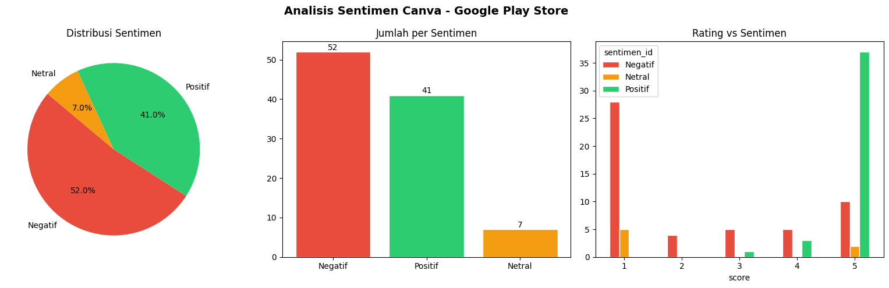

# 📱 Analisis Sentimen Aplikasi SATUSEHAT (Google Play Store)

**Identitas Mahasiswa:**
* **Nama:** Terry Djong
* **NIM:** 14022300086

Proyek ini dibangunkan untuk menganalisis sentimen ulasan pengguna terhadap aplikasi **SATUSEHAT** (sebelumnya PeduliLindungi) di Google Play Store sebagai bagian dari analisis Big Data.

## 🚀 Deskripsi Proyek
Proyek ini melakukan ekstraksi data (*web scraping*) ulasan SATUSEHAT, memproses teks, dan mengklasifikasikan sentimen pengguna ke dalam kategori **Positif**, **Negatif**, atau **Netral**. Proses ini menggunakan model *Natural Language Processing* (NLP) berbasis RoBERTa. Hasil analisis kemudian divisualisasikan dalam bentuk grafik yang jelas dan mudah dipahami.

## 📂 Struktur File
* **`UTS_BIG_DATA_TERRY.ipynb`**: File utama Jupyter Notebook yang berisi kode untuk scraping ulasan, pemrosesan analisis sentimen, dan visualisasi data.
* **`ulasan_google_play.csv`**: Dataset mentah ulasan pengguna yang diekstrak langsung dari Google Play Store.
* **`image.png`**: Grafik visualisasi hasil analisis sentimen (Distribusi Sentimen, Jumlah per Sentimen, dan Hubungan Rating vs Sentimen).

## 🛠️ Teknologi & Library yang Digunakan
* **Python 3**
* **google-play-scraper**: Untuk mengambil data ulasan secara otomatis.
* **Pandas**: Untuk manipulasi, pembersihan data, dan manajemen kerangka data (DataFrame).
* **Hugging Face Transformers**: Model `w11wo/indonesian-roberta-base-sentiment-classifier` untuk klasifikasi sentimen teks bahasa Indonesia.
* **Matplotlib & tqdm**: Untuk menampilkan visualisasi grafik dan *progress bar*.

## 📊 Visualisasi & Ringkasan Hasil Analisis

Berikut adalah visualisasi dari hasil analisis sentimen yang telah dilakukan:

Berdasarkan data ulasan aplikasi SATUSEHAT, secara umum sentimen dapat diringkas sebagai berikut:
* **Sentimen Negatif**: Mayoritas berisi keluhan pengguna terkait kendala *login*, sesi yang sering terkeluar (*logout* otomatis), sertifikat vaksin/rekam medis yang tidak muncul, atau kendala sinkronisasi data.
* **Sentimen Positif**: Pengguna merasa terbantu dengan kemudahan mengecek riwayat kesehatan, antrean rumah sakit, serta integrasi data kesehatan yang semakin baik.
* **Sentimen Netral**: Pertanyaan seputar cara penggunaan fitur baru, pembaruan data diri, atau saran pengembangan antarmuka aplikasi.

## ⚙️ Cara Menjalankan Proyek
1. Buka file `UTS_BIG_DATA_TERRY.ipynb` menggunakan **Google Colab** atau **Jupyter Notebook**.
2. Jalankan *cell* pertama untuk menginstal library yang diperlukan (`pip install google-play-scraper`).
3. Jalankan *cell* berikutnya secara berurutan untuk mengumpulkan data ulasan, memuat model *Machine Learning*, dan menampilkan visualisasi hasil analisis sentimen.
